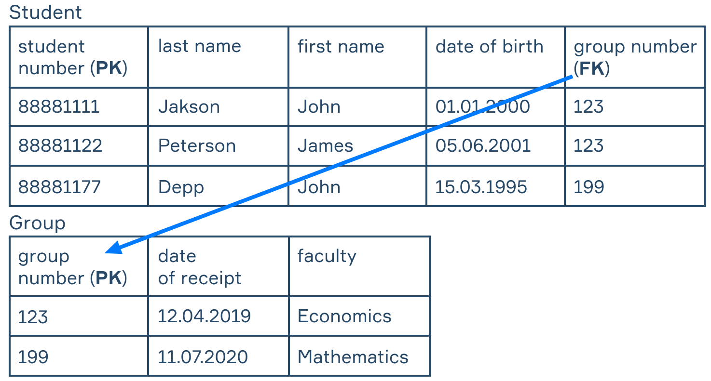

# 简介  **Relational Data Model** (RDM)

> 关系数据模型, 现代数据库模型就是在此基础上设计的. 简称RDM.

主要的几个关系型数据库管理系统:`Postgres`, `MySQL`, `Oracle` 了解 RDM 将帮助您更好地理解构建现代数据库的概念并胜任设计信息系统.

# 重要概念

**关系**本质上是一个代表某个实体或关系的二维表.

> 关系 就是 表 !!!

某个 **实体** 对象(如 OOP 中的类)的抽象, 例如学生, 汽车, 建筑物. **关系** 定义了实体如何相互连接. 例如,每个学生在其中一个小组中学习,这种关系在 Relational DB 中称为 **多对一关系** (更多关于下面的关系类型).

*A relation consists of attributes and tuples* 关系由属性和元组构成.

## 属性 attribute & 元组 tuple

在面向对象编程语言中, 一个类表示为:

```java
class Student {
    String studentNumber;
    String lastName;
    Stirng firstName;
    String dateOfBirth;
}
```

那么如果是结构体的语言呢?

```go
type Student struct {
    studentNumber string
    lastName string
    firstName string
    dateOfBirth string
}
```

不论那种方式, 其中的`studentNumber`, `lastName`等均用来表示**属性**(attribute). 那么在数据库中, 这样的类或者结构体, 可以表示为一个**表**.

编程语言中基于类可以创建非常多个实例, 当然准确来说叫**对象**; 同理, 结构体也可以创建多个实例. 那么数据库的表, 也可以添加多个**元组**.

类比总结来说, 属性就是表的**列**.元组就是表的每一**行**. 一个表可以存储多行, 也就是多个具有相同属性的实例.

前文提到, **关系就是表**不要忘记!

例如,对于具有学号,姓氏,名字,出生日期等属性的学生关系, 一个元组可以是 `88881111`*,*  `Jackson`*,*  `John`*,  `01.01.2000`*.  在数据库表中的具体存储如下:

| student number | last name | first name | date of birth |
| -------------- | --------- | ---------- | ------------- |
| 88881111       | Jackson   | John       | 01.01.2000    |

与其属性的关系可以简单地表示如下: `Student`*(* `student number`*,*  `last name`*,*  `first name`*,*  `date of birth`*)* .

# 限制条件

对关系数据模型中的关系施加以下限制:

1. 数据库中不能有两个同名的关系.
2. 同一关系中的所有属性必须具有不同的名称.
3. 每个单元格中应该只有一个值.
4. 关系中的行和列的顺序并不重要.

# 实体完整性 entity integrity

**Integrity** is the conformity of a data model with certain rules. There are two kinds of integrity: **entity integrity** and **referential integrity**.

完整性是数据模型与某些规则的一致性.  完整性有两种:实体完整性和参照完整性.

实体完整性:每一个实体都是独一无二的.不可能存在两个完全相同的**元组**(行).为了维护实体完整性,引入了主键(PK)概念.(**primary key** )



如果我们想添加以下关于学生的记录怎么办: `88881188`*,*  `Madison`*,*  `Peter`*,*  `01.02.2002`*,*  `132`?  这将导致参照完整性违规,因为我们没有组 `group number` 等于 `132`*.*

# 参照完整性 referential integrity

**Referential integrity** occurs when we have two connected relations. The relationship of the relations is provided using a **foreign key (FK)**.

两个连接发生关系时,就会使用外键(FK).

例如,有两个关系:学生和组.  Group  有一个属性号,即主键,Student 关系有相同的属性,表示学生属于某个组.  在学生关系中,组号是外键.  如果在 Student  表中某个元组的外键值指向不在 Group 表中的组的元组,则将违反参照完整性.

| 学生号码 | 姓     | 名     | 出生日期   | 组号 |
| -------- | ------ | ------ | ---------- | ---- |
| 88881111 | 杰克逊 | 约翰   | 01.01.2000 | 123  |
| 88881122 | 彼得森 | 詹姆士 | 05.06.2001 | 123  |
| 88881177 | 德普   | 约翰   | 15.03.1995 | 199  |

学生

| 组号 | 注册日期   |
| ---- | ---------- |
| 123  | 12.04.2019 |
| 199  | 11.07.2020 |

FK 用于创建多对一(一对多)关系.

# 关系 relationships

存在一对一,一对多和多对多类型的关系

- **一对一关系 (1-1)** 意味着第一个关系的一个元组只能与另一个关系的一个元组关联. 反之亦然.

  > 比如护照--公民(一个人只能有一本护照,一本护照指一个人).

- **一对多关系(1-M)** 意味着第一个关系的一个元组可以与第二个关系的一个或多个元组相关联,但反之则 *不然* . 第二个关系的任何元组 *只能与第一个关系的一个* 元组相关联.

  > 比如学生--组(一个组可以有很多学生,但每个学生只属于一个组).

- **多对多(MM)**  **关系** 意味着第一个关系的任何元组都可以与另一个关系的一个或多个元组相关联. 反之亦然.
  
  > 比如学生--学科(每个学生学习很多学科,每个学科可以被很多学生学习).  

上述任何关系都可以是识别的或非识别的. 关系正在 **识别** 从属关系的外键是否进入(或成为其主键的一部分). 例如,商店中的订单号(订单关系的PK)是根据客户号和订单日期生成的. 客户编号是客户关系的PK. 订单号是两个属性的复合PK:客户号(也是外键)和订单日期.

在 **非标识** 关系中,外键关系不会指向主键,例如上面讨论的 Student-Group 关系.
